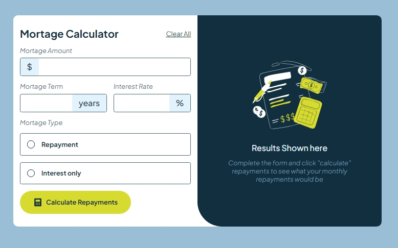

# Frontend Mentor - Mortgage repayment calculator solution

This is a solution to the [Mortgage repayment calculator challenge on Frontend Mentor](https://www.frontendmentor.io/challenges/mortgage-repayment-calculator-Galx1LXK73). Frontend Mentor challenges help you improve your coding skills by building realistic projects. 

## Table of contents

- [Overview](#overview)
  - [The challenge](#the-challenge)
  - [Screenshot](#screenshot)
  - [Links](#links)
- [My process](#my-process)
  - [Built with](#built-with)
  - [What I learned](#what-i-learned)
- [Author](#author)


## Overview

### The challenge

Users should be able to:

- Input mortgage information and see monthly repayment and total repayment amounts after submitting the form
- See form validation messages if any field is incomplete
- Complete the form only using their keyboard
- View the optimal layout for the interface depending on their device's screen size
- See hover and focus states for all interactive elements on the page

### Screenshot




### Links

- Solution URL: [Add solution URL here](https://github.com/dimitrisdr/mortgage-repayment-calculator.git)
- Live Site URL: [Add live site URL here](https://dimitrisdr.github.io/mortgage-repayment-calculator/)

## My process

### Built with

- Semantic HTML5 markup
- CSS custom properties
- Flexbox
- CSS Grid
- Mobile-first workflow
- [React](https://reactjs.org/) - JS library


To see how you can add code snippets, see below:

```css

@font-face {
  font-family: 'Plus Jakarta Sans';
  src: url('/assets/fonts/PlusJakartaSans-VariableFont_wght.ttf') format('truetype');
  font-style: normal;
  font-weight: 100 900;
}
```
```js
import { useContext, useEffect } from "react"
import { DataContext } from "../hooks/clearContext"


export default function CalculatedResults() {

    const {inputValues, setInputValues, formIsValid, setFormIsValid} = useContext(DataContext)
    const {amount, term, rate, mortageType} = inputValues

    function calculateMortageData(amount, term, rate, mortageType) {

        if (!formIsValid) return 

        const principal = parseFloat(amount)
        const months = parseFloat(term) * 12
        const interstRate = parseFloat(rate) / (12*100)
        const payments = Math.floor((((principal *interstRate)*Math.pow(1 + interstRate, months))/(Math.pow(1 + interstRate, months) - 1)) * 1000) / 1000
        
        if (months > 100000) {
            return 'Large number of years!'
        }
        if (!payments || principal < 0 || months < 0 || interstRate < 0) {
            return 'invalid values!'
        }
        
        if (Number(rate) > 100) {
            return 'invalid interest rate!'
        }
        const mortageTypeOptions = {
            repayment: payments,
            interestOnly: Math.floor((principal * interstRate) *1000) / 1000
        }

        return mortageTypeOptions[mortageType]
    }

    const monthlyPayment = calculateMortageData(amount, term, rate, mortageType)

    return(
        <section className="results-section bg-clr-slate-900 grid-item" aria-label="Calculation Results">
            <h2 className="title results-title clr-slate-100 fw-500 fs-500">Your Results</h2>
            <p className="results-section-text clr-slate-700">
                Your results are shown below based 
                on the information you provided. 
                To adjust the results, edit the form and click
                "calculate" repayments again.
            </p>
            <div className="calc-results-container grid-item">
                <div className="calc-results grid-item bg-clr-slate-950">
                    <div className="calc-results-item grid-item">
                        <p className="results-text clr-slate-500">Your monthly repayments</p>
                        <p className="results-num main-results-num fw-700 clr-lime ">{monthlyPayment}</p>
                    </div>
                    <div className="calc-results-item grid-item">
                        <p className="results-text clr-slate-500">Total you 'll repay over the term</p>
                        <p className="results-num fw-700 fs-500 clr-slate-100">{Number(monthlyPayment)? Math.round(monthlyPayment) * 12 *term : monthlyPayment}</p>
                    </div>
                </div>
            </div>
        </section>
    )
}

```

## Author

- Frontend Mentor - [@yourusername](https://www.frontendmentor.io/profile/dimitrisdr)
